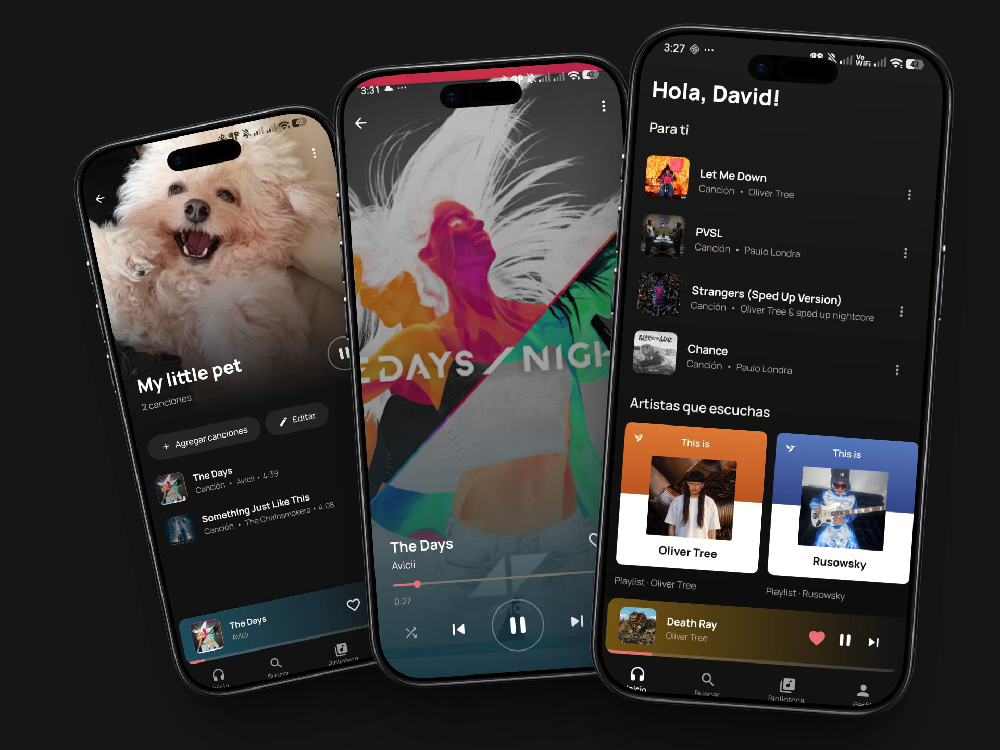

<div align="center">


# Vint

**Your music, without limits.**

A modern Android music app built with Jetpack Compose. Stream, download, and organize your favorite music — all in one place.

<br/>

[](https://kotlinlang.org)
[](https://developer.android.com/jetpack/compose)
[](https://developer.android.com)
[](https://developer.android.com)

[](https://ko-fi.com/davidsimbaec)
[](https://github.com/davidsimba/VintBeats/releases/latest)

</div>

---

## About

Vint is a music streaming and library app for Android. It streams audio using NewPipe Extractor as the primary source with a custom backend as fallback, supports offline downloads, synced lyrics, playlists, favorites, and a home screen widget — all wrapped in a clean vintage-inspired UI.

---

<div align="center">
  
</div>

---

## Features

- 🔍 **Search** — Find tracks, artists and albums
- 🎧 **Streaming** — High-bitrate audio via NewPipe Extractor with backend fallback
- ⬇️ **Downloads** — Save songs offline in `.m4a` format
- ❤️ **Favorites** — Mark and access your favorite tracks instantly
- 📋 **Playlists** — Create and manage personal playlists with custom covers
- 🎤 **Synced Lyrics** — Real-time scrolling lyrics via LrcLib
- 🎵 **Queue & History** — Full playback queue management with shuffle and history
- 🏠 **Home Screen Widget** — Now Playing widget with media controls
- 🎚️ **Equalizer** — System equalizer integration
- ⚡ **Auto-download Favorites** — Automatically download songs when favorited
- 🎨 **Dynamic Palette** — UI accent colors extracted from album art
- 👤 **Profile** — Personalized profile with photo and display name

---

## Tech Stack

| Layer | Technology |
|---|---|
| Language | Kotlin 2.0 |
| UI | Jetpack Compose, Material 3 |
| Architecture | MVVM + Clean Architecture |
| Dependency Injection | Hilt |
| Database | Room |
| Preferences | DataStore |
| Networking | Retrofit + OkHttp |
| Audio Extraction | NewPipe Extractor |
| Media Playback | Media3 (ExoPlayer) + MediaSession + custom streaming backend |
| Image Loading | Coil |
| Security | AndroidX Security Crypto |
| Widget | Glance AppWidget |
| Navigation | Jetpack Navigation Compose |

---

## Architecture

```
app/
├── core/           # Database, network, models, player setup
├── feature/        # One package per screen (home, search, player, library, profile...)
│   ├── home/
│   ├── search/
│   ├── player/
│   ├── library/
│   ├── album/
│   ├── artist/
│   ├── playlist/
│   ├── profile/
│   └── onboarding/
├── navigation/     # NavGraph + Screen routes
└── shared/         # Shared components, ViewModels, theme
```

Each feature follows the pattern: `data` → `domain` → `ui`, with Hilt injecting dependencies across layers.

---

## Support

If you find Vint useful, consider supporting development:

[](https://ko-fi.com/davidsimbaec)

---

<div align="center">

Made with ❤️ by **David Simba** · © 2026 Vint

</div>
